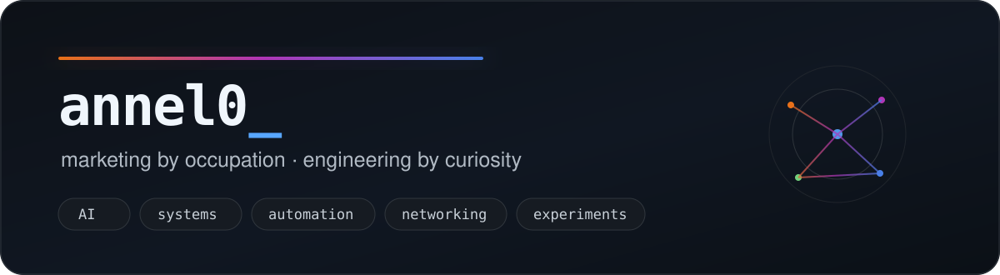
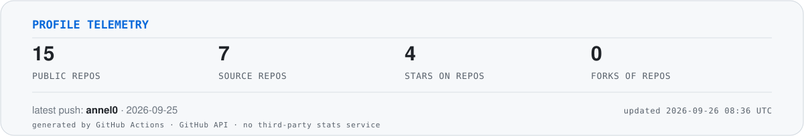

<picture>
  <source media="(prefers-color-scheme: dark)" srcset="./assets/hero-dark.svg">
  <source media="(prefers-color-scheme: light)" srcset="./assets/hero-light.svg">
  
</picture>

<p align="center">
  <strong>I work in marketing and AI. My personal projects keep drifting toward systems engineering.</strong>
</p>

<p align="center">
  Python · Linux · CUDA / Triton · Networking · Automation · LLMs · APIs · Docker / Proxmox
</p>

---

### About

I am a self-taught developer and prompt engineer working around **marketing, AI and automation**.

Outside work, I tend to follow technical questions farther than necessary: into GPU kernels, network protocols, unfamiliar codebases, game internals, infrastructure, or whatever else happens to be behind the next layer.

I care more about **understanding why something works** than collecting a particular stack.

```text
question → prototype → measure → break assumptions → rebuild → document what survived
```

### Selected work

<table>
<tr>
<td width="50%" valign="top">
<h4>🪰 <a href="https://github.com/annel0/flybrain">flybrain</a></h4>
<p>GPU simulator for connectome-constrained spiking models of the Drosophila CNS.</p>
<p>Hand-written Triton kernels, sparse connectivity, validation against published results, and a fairly long list of experiments that failed honestly.</p>
<p><code>Python</code> <code>Triton</code> <code>CUDA</code> <code>computational neuroscience</code></p>
</td>
<td width="50%" valign="top">
<h4>🌾 <a href="https://github.com/annel0/Starfield-Pastoral">Starfield Pastoral — Russian localization</a></h4>
<p>A now-archived localization fork that existed before the upstream mod had a proper multilingual architecture.</p>
<p>The translation was later integrated into the official project, where it continues to be maintained upstream.</p>
<p><code>Java</code> <code>Minecraft / NeoForge</code> <code>localization</code> <code>open source</code></p>
</td>
</tr>
<tr>
<td width="50%" valign="top">
<h4>🌐 <a href="https://github.com/amurcanov/proxy-turn-vk-android/pull/214">proxy-turn-vk-android — contribution #214</a></h4>
<p>Reduced server load by optimizing memory allocation in the RTP obfuscation path. The change was merged upstream and shipped in a public release.</p>
<p><code>Go</code> <code>Android</code> <code>networking</code> <code>performance</code></p>
</td>
<td width="50%" valign="top">
<h4>🧪 Everything else</h4>
<p>Small tools, forks, prototypes, game experiments, networking utilities and ideas that escaped the scratchpad.</p>
<p>A repository here does not necessarily mean <em>product</em>. Sometimes it means <em>I needed to know whether this was possible</em>.</p>
<p><code>systems</code> <code>automation</code> <code>experiments</code></p>
</td>
</tr>
</table>

### What tends to pull me in

- **AI & agents** — LLM workflows, local models, prompt engineering, automation and tooling around them.
- **Systems & performance** — profiling, memory traffic, GPU compute, runtimes and weird bottlenecks.
- **Networking & infrastructure** — Linux, VPNs, proxies, servers, virtualization and homelab work.
- **Existing systems** — reading somebody else's code until the original limitation becomes fixable.
- **Experiments** — the useful kind, where the result is allowed to be “this idea does not survive contact with reality”.

### Open-source footprint

- Russian localization work from my archived fork is credited and maintained in the official [Starfield Pastoral](https://github.com/ChangQingElysium/Starfield-Pastoral) project.
- Performance work from [PR #214](https://github.com/amurcanov/proxy-turn-vk-android/pull/214) was merged into `proxy-turn-vk-android` and included in its release notes.

### Profile telemetry

<p align="center">
  
</p>

<sub>The card above is generated inside this repository by GitHub Actions. No external stats service is required.</sub>

---

<p align="center">
  <code>Most repositories here started with “I wonder if this is possible.”</code>
</p>
